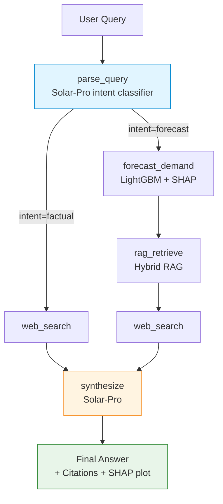

[English README](README_eng.md)

---

# 화물 수요예측 에이전트 (Cargo Demand Agent)

> LA 항만 컨테이너 물동량 예측 결과를 머신러닝 수요예측 모델 + 사내 RAG + 웹검색으로
> 종합해 자연어로 설명해주는 LLM 에이전트.

---

## 한 줄 소개

LA 항만 물동량 수요예측 실무의 **"수요예측 + 근거 + 권장 액션"** 보고 프로세스를 
LangGraph 기반 LLM 에이전트로 자동화.

---

## 핵심 가치

수요예측 모델과 함께 웹검색/RAG를 통해 **"왜 이 숫자인가"를 의사결정자에게 설명**한다. 다음 세 컨텍스트를 종합:

| 컨텍스트 | 출처 | 역할 |
|---|---|---|
| 정량 | LightGBM 예측치 + SHAP top-3 driver | "어떤 feature가 얼마나 영향?" |
| 정성 | 사내 RAG 보고서 (Hybrid retriever) | "그 driver의 도메인 의미" |
| 외부 검증 | Tavily Web Search | "현재 외부 지표값은?" |

> *LightGBM = gradient boosting 트리 모델, SHAP = 예측 결과를 변수별 기여도로 분해하는 기법.*

→ LLM(Solar-Pro)가 셋을 종합해 **"예측치 + 근거 + 권장 액션"** 자연어 답변 생성.

---

## 시스템 아키텍처

LangGraph `StateGraph`. `parse_query`에서 intent로 분기되는 6-Node 파이프라인.
조건부 분기 1곳만 두어 디버깅 용이성 + 비용 제어 유지.



- **factual** (3-step): `parse → web_search → synthesize` (단답)
- **forecast** (5-step): `parse → forecast → rag → web_search → synthesize` (풀 분석)

---

## 기술 스택

| Layer | Technology |
|---|---|
| LLM | Upstage Solar-Pro (`langchain-upstage.ChatUpstage`) |
| Agent | LangChain 1.x + LangGraph (`StateGraph`, `add_conditional_edges`) |
| Hybrid RAG | BGE-M3 dense + Chroma + MMR + BM25 (Kiwi 한국어 형태소) + RRF fusion |
| Forecast | LightGBM (4 horizons: 1 / 3 / 6 / 12 months) |
| Explainability | SHAP `TreeExplainer` |
| Web Search | Tavily |
| UI | Streamlit |

> *MMR = 다양성 확보 re-ranking, RRF = 여러 ranker 순위 결합 기법.*

### Hybrid Retrieval 차별화

| 컴포넌트 | 역할 |
|---|---|
| Dense (BGE-M3) | 의미적 유사도. paraphrased 쿼리에 강함 |
| Sparse (BM25 + Kiwi 형태소 분석기) | 한국어 조사 분리 (`수요에` → `수요`) → 짧은 키워드(PMI, FBX, GRI) 정확 매칭 |
| RRF fusion | 두 ranker의 Reciprocal Rank Fusion (`langchain_classic.retrievers.EnsembleRetriever`) |

→ Dense-only retrieval로는 추상 쿼리(예: `"PMI 50 돌파가 화물 수요에 미치는 영향"`)에서
정타 챕터를 끌어오지 못했지만, **Kiwi 형태소 + BM25 결합 후 정타 등장**.
3-way 비교: [`evaluation/results_d1.md`](evaluation/results_d1.md).

---

## 수요예측 모델 성능

LA 항만 컨테이너 처리량 데이터 (2009-01 ~ 2025-12, **204 monthly records**) 기반 학습.
Rolling-Origin Backtest 결과:

| Horizon | MAPE | RMSE | MAE |
|---|---|---|---|
| 1개월 | **6.52%** | 79,950 | 60,240 |
| 3개월 | **6.32%** | 74,366 | 56,031 |
| 6개월 | 13.21% | 116,412 | 110,357 |
| 12개월 | 10.22% | 119,573 | 94,711 |

> *Rolling-Origin Backtest = 학습 종료 시점을 한 달씩 밀어가며 다음달 예측의 오차를 측정하는 시계열 검증 방법.*

- **데이터 출처**: LA Open Data API (2009-2016) + POLA 공식 사이트 manual (2016-2025)
- **외생변수 5개**: FBX(synthetic), Diesel, GSCPI(NY Fed), PMI proxy(IPMAN), Peak season

---

## End-to-End 평가

3 시나리오 (factual / forecast h=1 / forecast h=3) 자동 검증: [`evaluation/eval_agent_e2e.py`](evaluation/eval_agent_e2e.py).

| Scenario | Intent 분류 | Horizon 추출 | 결과 |
|---|---|---|---|
| `최근 미국 디젤 가격은?` | factual ✓ | - | Tavily 단답 + 4 web 인용 |
| `다음달 LA Port ...` | forecast ✓ | 1 ✓ | 848,765 TEU @ 2026-01, top-3 driver, 사내 보고서 5건 + web 1건 인용 |
| `3개월 후 LA Port ...` | forecast ✓ | 3 ✓ | 799,309 TEU @ 2026-03 (h=3 모델, 다른 driver 노출), 음수 driver 자연 표시 |

**Engineering 요점:**
- **horizon regex fallback**: Solar-Pro `with_structured_output`이 `horizon_months` 필드를 비워두는 quirk를 한국어/영어 패턴 매칭으로 복구
- **hallucination 방지**: synthesize prompt에 vintage 라벨, lag-out-of-range 룰 등을 추가해 컨텍스트 외 인용 차단

---

## 한계 + Future Work

| 한계 | 개선 방향 |
|---|---|
| LA Port 단일 도메인 (다른 항만 미지원) | Singapore PSA, Hong Kong, Busan 모델 추가 |
| RAG 코퍼스가 합성 보고서 7개 (실제 영업 데이터 없음) | IATA / Drewry 정식 라이선스 후 코퍼스 |
| LightGBM 단일 모델 (앙상블 미적용) | TFT, Prophet 등 ensemble |
| 학습 데이터가 2025-12 까지 (모델은 학습 데이터 기준 N개월 후를 예측) | POLA 월별 통계 갱신 자동화 |

---

## 프로젝트 구조

```
cargo-demand-agent/
├── src/cargo_demand_agent/        # 핵심 패키지
│   ├── agent.py                   # LangGraph StateGraph (6 nodes)
│   ├── tools.py                   # forecast / web_search / rag tool
│   ├── retriever.py               # Hybrid RAG (BGE-M3 + BM25 + Kiwi + RRF)
│   ├── loader.py                  # 보고서 .md 로드 + chunking
│   ├── schemas.py                 # Pydantic v2 (AgentState, ForecastResult)
│   ├── prompts.py                 # intent / synthesize prompts
│   └── i18n.py                    # ko / en locale
│
├── data/
│   ├── pola_teu.csv               # 204 monthly records (2009-01 ~ 2025-12)
│   ├── models/                    # LightGBM h={1,3,6,12} + scaler + metadata
│   └── reports/ko/                # 사내 합성 보고서 7개 (RAG 코퍼스)
│
├── evaluation/
│   ├── eval_agent_e2e.py          # 3 시나리오 e2e 검증
│   ├── eval_rag.py                # RAG retrieval 평가 스크립트
│   └── results_d1.md              # 3-way retrieval 비교 결과
│
├── practice/01_explore.ipynb      # EDA + LightGBM/SHAP + RAG + e2e 탐색
│
├── app.py                         # Streamlit demo UI
├── main.py                        # CLI 엔트리
├── requirements.txt
├── .env.example
└── README.md
```

---

## 사용법

```bash
# 1. 환경 설정
git clone <repo>
cd cargo-demand-agent
python -m venv .venv
.venv/Scripts/activate         # Windows / Git Bash
# source .venv/bin/activate    # macOS / Linux

pip install -r requirements.txt
cp .env.example .env           # UPSTAGE_API_KEY, TAVILY_API_KEY 입력

# 2. RAG 인덱스 빌드 (최초 1회 + 보고서 변경 시)
python -m src.cargo_demand_agent.loader

# 3. CLI 실행
python main.py "다음달 LA Port 컨테이너 처리량과 드라이버 분석"
python main.py "최근 미국 디젤 가격은?" --verbose

# 4. Streamlit UI
streamlit run app.py
```

`.env` (참고: `.env.example`):
```
APP_LOCALE=ko             # ko | en
UPSTAGE_API_KEY=up_...
TAVILY_API_KEY=tvly-...
```

---

## Background

본 프로젝트는 LA Port 컨테이너 처리량 예측을 다룬 [Forecasting_TEU](https://github.com/yoon-chung/Forecasting_TEU)
(Georgia Tech 팀 프로젝트, 93개월 파일럿)의 후속이다. 데이터를 204개월로 확장하고
LightGBM/SHAP를 LangGraph + Solar-Pro 위에 얹어, **모델 정확도에서 끝났던
파이프라인에 "왜?" 설명 layer를 더한** 형태.

---

## 데이터 출처 및 면책 조항

본 프로젝트의 RAG 원천 문서(`data/reports/ko/`)는 다음 공개 자료를 종합·재구성한
**합성 분석 보고서**입니다:

- Port of Los Angeles 공식 통계 (portoflosangeles.org)
- Port of Long Beach Monthly Statistics
- NWSA (Northwest Seaport Alliance) 통계
- Drewry Container Insight Weekly
- Alphaliner Top 100, Sea-Intelligence GLP Reliability
- Federal Reserve Economic Data (FRED)
- NY Fed GSCPI
- IATA Cargo Market Analysis (보조)

**실제 영업 데이터는 일체 포함되지 않았습니다.**

---

## License

MIT
