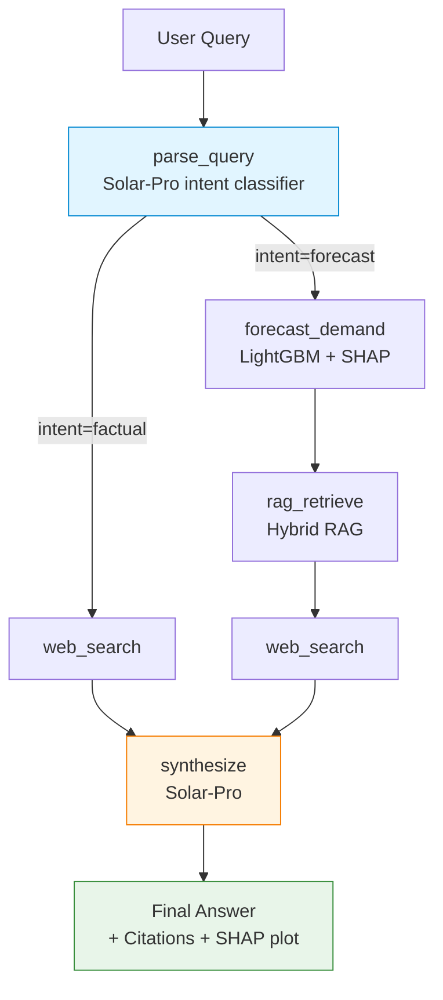

[한국어 README](README.md)

---

# Cargo Demand Agent

> An LLM agent that synthesizes machine learning demand forecasts, internal RAG-based reports, and web search to explain the *why* behind container throughput predictions for the Port of Los Angeles.

---

## Approach

This agent automates the **"Forecast + Reasoning + Recommended Action"** reporting workflow used in demand forecasting practice. Instead of outputting a number alone, the agent **explains "why this number"** to decision-makers by synthesizing three contexts:

| Context | Source | Role |
|---|---|---|
| Quantitative | LightGBM forecast + SHAP top-3 drivers | "Which features had how much impact?" |
| Qualitative | Internal RAG reports (Hybrid retriever) | "What does that driver mean in domain terms?" |
| External Validation | Tavily Web Search | "What is the current value of the external indicator?" |

> *LightGBM = gradient boosting tree model. SHAP = method that decomposes a prediction into per-feature contributions.*

→ The LLM (Solar-Pro) synthesizes all three into a natural-language answer: **"forecast + reasoning + recommended action."**

---

## System Architecture

LangGraph `StateGraph`. A 6-node pipeline branching from `parse_query` based on intent. Only one conditional branch is used — keeping debugging easy and cost predictable.



- **factual** (3-step): `parse → web_search → synthesize` (short answer)
- **forecast** (5-step): `parse → forecast → rag → web_search → synthesize` (full analysis)

---

## Tech Stack

| Layer | Technology |
|---|---|
| LLM | Upstage Solar-Pro (`langchain-upstage.ChatUpstage`) |
| Agent | LangChain 1.x + LangGraph (`StateGraph`, `add_conditional_edges`) |
| Hybrid RAG | BGE-M3 dense + Chroma + MMR + BM25 (Kiwi Korean morphological analyzer) + RRF fusion |
| Forecast | LightGBM (4 horizons: 1 / 3 / 6 / 12 months) |
| Explainability | SHAP `TreeExplainer` |
| Web Search | Tavily |
| UI | Streamlit |

> *MMR = re-ranking for diversity. RRF = Reciprocal Rank Fusion across multiple rankers.*

### Hybrid Retrieval Differentiation

| Component | Role |
|---|---|
| Dense (BGE-M3) | Semantic similarity. Strong at paraphrased queries |
| Sparse (BM25 + Kiwi morphological analyzer) | Tokenizes Korean particles separately (e.g., `수요에` → `수요` + `에`) → enables precise matching of short keyword queries (PMI, FBX, GRI) |
| RRF fusion | Reciprocal Rank Fusion combines the two rankers (`langchain_classic.retrievers.EnsembleRetriever`) |

Dense-only retrieval failed to surface the correct chapters for abstract queries (e.g., *"How does PMI crossing 50 impact cargo demand?"*). After adding Kiwi morphological analysis + BM25, the relevant chunks were surfaced.
3-way comparison: [`evaluation/results_d1.md`](evaluation/results_d1.md).

---

## Forecast Model Performance

Trained on Port of Los Angeles container throughput data (Jan 2009 – Dec 2025, **204 monthly records**).
Rolling-Origin Backtest results:

| Horizon | MAPE | RMSE | MAE |
|---|---|---|---|
| 1-month | **6.52%** | 79,950 | 60,240 |
| 3-month | **6.32%** | 74,366 | 56,031 |
| 6-month | 13.21% | 116,412 | 110,357 |
| 12-month | 10.22% | 119,573 | 94,711 |

> *Rolling-Origin Backtest = time-series validation that shifts the training cutoff month by month, measuring the forecast error for the next month each time.*

- **Data Sources**: LA Open Data API (2009–2016) + POLA official website manual entries (2016–2025)
- **5 Exogenous Variables**: FBX (synthetic), Diesel, GSCPI (NY Fed), PMI proxy (IPMAN), Peak season

---

## End-to-End Evaluation

3 scenarios (factual / forecast h=1 / forecast h=3) auto-verified via [`evaluation/eval_agent_e2e.py`](evaluation/eval_agent_e2e.py).

| Scenario | Intent Classification | Horizon Extraction | Result |
|---|---|---|---|
| `What is the recent US diesel price?` | factual ✓ | – | Tavily short answer + 4 web citations |
| `Next month LA Port ...` | forecast ✓ | 1 ✓ | 848,765 TEU @ 2026-01, top-3 drivers, 5 internal reports + 1 web citation |
| `3 months ahead LA Port ...` | forecast ✓ | 3 ✓ | 799,309 TEU @ 2026-03 (h=3 model, different drivers exposed), negative drivers shown naturally |

**Engineering highlights:**

- **Horizon regex fallback**: Solar-Pro's `with_structured_output` occasionally leaves the `horizon_months` field empty; recovered via Korean/English pattern matching
- **Hallucination prevention**: Synthesize prompt enforces data vintage tags (timestamp metadata) and lag-out-of-range rules to block out-of-context citations

---

## Limitations & Future Work

| Limitation | Direction |
|---|---|
| Single domain (LA Port only; other ports not supported) | Add Singapore PSA, Hong Kong, Busan models |
| RAG corpus is 7 synthetic reports (no real business data) | Licensed corpus from IATA / Drewry |
| Single LightGBM model (no ensemble) | TFT, Prophet ensembles |
| Training data through Dec 2025 (model predicts N months ahead from that cutoff) | Automate POLA monthly statistics ingestion |

---

## Project Structure

```
cargo-demand-agent/
├── src/cargo_demand_agent/        # Core package
│   ├── agent.py                   # LangGraph StateGraph (6 nodes)
│   ├── tools.py                   # forecast / web_search / rag tools
│   ├── retriever.py               # Hybrid RAG (BGE-M3 + BM25 + Kiwi + RRF)
│   ├── loader.py                  # Report .md loading + chunking
│   ├── schemas.py                 # Pydantic v2 (AgentState, ForecastResult)
│   ├── prompts.py                 # Intent / synthesize prompts
│   └── i18n.py                    # ko / en locale
│
├── data/
│   ├── pola_teu.csv               # 204 monthly records (2009-01 ~ 2025-12)
│   ├── models/                    # LightGBM h={1,3,6,12} + scaler + metadata
│   └── reports/ko/                # 7 synthetic internal reports (RAG corpus)
│
├── evaluation/
│   ├── eval_agent_e2e.py          # 3-scenario e2e verification
│   ├── eval_rag.py                # RAG retrieval evaluation script
│   └── results_d1.md              # 3-way retrieval comparison results
│
├── practice/01_explore.ipynb      # EDA + LightGBM/SHAP + RAG + e2e exploration
│
├── app.py                         # Streamlit demo UI
├── main.py                        # CLI entry
├── requirements.txt
├── .env.example
└── README.md
```

---

## Usage

```bash
# 1. Environment setup
git clone <repo>
cd cargo-demand-agent
python -m venv .venv
.venv/Scripts/activate         # Windows / Git Bash
# source .venv/bin/activate    # macOS / Linux

pip install -r requirements.txt
cp .env.example .env           # Enter UPSTAGE_API_KEY, TAVILY_API_KEY

# 2. Build RAG index (first time + when reports change)
python -m src.cargo_demand_agent.loader

# 3. Run CLI
python main.py "Next month LA Port container throughput and driver analysis"
python main.py "What is the recent US diesel price?" --verbose

# 4. Streamlit UI
streamlit run app.py
```

`.env` (see `.env.example`):

```
APP_LOCALE=en             # ko | en
UPSTAGE_API_KEY=up_...
TAVILY_API_KEY=tvly-...
```

---

## Background

This project is the successor to [Forecasting_TEU](https://github.com/yoon-chung/Forecasting_TEU) (Georgia Tech team project, 93-month pilot) on Port of Los Angeles container throughput forecasting. In this project, the dataset is extended to 204 months, and LightGBM/SHAP is layered onto LangGraph + Solar-Pro — adding a **"why?" explanation layer to a pipeline that previously ended at model accuracy**.

---

## Data Sources & Disclaimer

The RAG source documents in `data/reports/ko/` are **synthetic analytical reports** synthesized and reconstructed from the following public materials:

- Port of Los Angeles official statistics (portoflosangeles.org)
- Port of Long Beach Monthly Statistics
- NWSA (Northwest Seaport Alliance) statistics
- Drewry Container Insight Weekly
- Alphaliner Top 100, Sea-Intelligence GLP Reliability
- Federal Reserve Economic Data (FRED)
- NY Fed GSCPI
- IATA Cargo Market Analysis (supplementary)

**No actual operational data is included.**

---

## License

MIT
